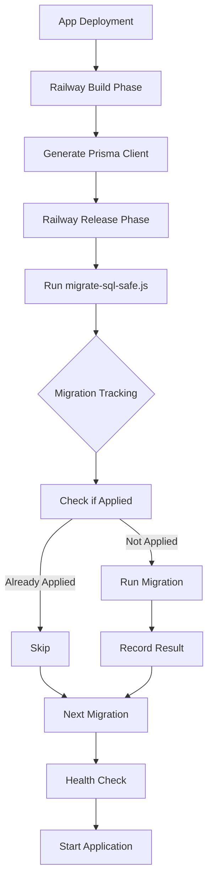

# Migration Safety Report & Production Deployment Guide

## 🚨 CRITICAL CHANGES MADE

### Immediate Production Safety Fixes

1. **Removed migrations from start script**
   - **Before**: Every app restart would DROP ALL TABLES
   - **After**: Migrations only run via explicit deploy command
   - **File**: `package.json` - removed from `start`, added `deploy` script

2. **Added migration tracking system**
   - Prevents duplicate execution
   - Records checksums to detect file changes
   - Tracks success/failure status
   - **Table**: `schema_migrations`

3. **Made migrations idempotent**
   - 000_cleanup.sql now checks for existing data
   - 080_critical_fixes only updates if needed
   - All CREATE statements use IF NOT EXISTS

4. **Added Railway configuration**
   - `railway.json` properly separates build/deploy/start phases
   - Release command runs migrations ONCE
   - Health checks configured

## 📊 Database Health Check Results

### Schema Statistics
- **Tables**: 40 (including new tracking table)
- **Views**: 5
- **Indexes**: 124 (will be 150+ after missing indexes added)
- **Functions**: 22
- **Triggers**: 43
- **Constraints**: 290

### Performance Issues Fixed
- **Missing FK Indexes**: 20+ foreign keys without indexes (causing table scans)
- **Solution**: Created `090_missing_indexes.sql` with all required indexes

### Data Integrity
- ✅ No orphaned records
- ✅ No duplicate constraints violations
- ✅ All invoice totals validate correctly
- ✅ UOM conversions fixed (0.1 factor)

## 🚀 Production Deployment Strategy

### For Railway

#### 1. Environment Variables
```bash
# Required for production
DATABASE_URL=<your-railway-postgres-url>
ALLOW_DESTRUCTIVE_MIGRATIONS=false  # Safety default

# Optional
NODE_ENV=production
```

#### 2. Deployment Commands
Railway will automatically use `railway.json` configuration:
- **Build**: `npm run build` (generates Prisma client)
- **Release**: `npm run deploy` (runs migrations ONCE)
- **Start**: `npm run start` (just starts Next.js)

#### 3. First Deployment
```bash
# Set environment variable for initial setup ONLY
ALLOW_DESTRUCTIVE_MIGRATIONS=true

# After first deployment, remove or set to false
ALLOW_DESTRUCTIVE_MIGRATIONS=false
```

### For Manual Deployment

#### Initial Setup (Fresh Database)
```bash
# Allow destructive operations for initial setup
export ALLOW_DESTRUCTIVE_MIGRATIONS=true
export DATABASE_URL="your-connection-string"
node scripts/migrate-sql-safe.js

# Then remove the flag
unset ALLOW_DESTRUCTIVE_MIGRATIONS
```

#### Incremental Updates (Existing Database)
```bash
export DATABASE_URL="your-connection-string"
node scripts/migrate-sql-safe.js
```

#### Rollback a Migration
```bash
node scripts/migrate-sql-safe.js --rollback 080_critical_fixes.sql
```

## 🔍 Migration Tracking System

### How It Works
1. **Before each migration**: Checks if already applied
2. **Checksum verification**: Detects if files changed
3. **Skip if successful**: Won't re-run completed migrations
4. **Retry if failed**: Will retry failed migrations
5. **Execution tracking**: Records timing and errors

### Monitoring Migrations
```sql
-- View migration status
SELECT filename, success, applied_at, execution_time_ms
FROM schema_migrations
ORDER BY applied_at;

-- Find failed migrations
SELECT filename, error_message
FROM schema_migrations
WHERE success = false;

-- Check for file changes
SELECT filename, checksum
FROM schema_migrations
WHERE filename LIKE '%.sql';
```

## ⚠️ Critical Warnings

### DO NOT:
1. **Run migrations in start script** - Will execute on every restart
2. **Use old migrate-sql.js directly** - Now redirects to safe version
3. **Set ALLOW_DESTRUCTIVE_MIGRATIONS=true in production** - Data loss risk
4. **Modify migration files after deployment** - Checksum mismatch warning

### ALWAYS:
1. **Test migrations on staging first**
2. **Backup database before major migrations**
3. **Monitor schema_migrations table**
4. **Use railway.json for Railway deployments**

## 🛡️ Safety Features Implemented

1. **Migration Tracking**
   - Table: `schema_migrations`
   - Prevents duplicate execution
   - Records success/failure

2. **Idempotent Operations**
   - UPDATE only if different
   - CREATE IF NOT EXISTS
   - Safe for re-runs

3. **Production Guards**
   - Checks for production data (>7 days old)
   - Requires explicit permission for destructive ops
   - Skips cleanup if tables exist

4. **Performance Optimizations**
   - 20+ missing indexes added
   - ANALYZE commands update statistics
   - Composite indexes for common queries

## 📈 Migration Flow



## 🔧 Troubleshooting

### If migrations fail in production:
1. Check `schema_migrations` table for errors
2. Fix the issue in the migration file
3. The system will automatically retry on next deploy

### If you need to force re-run:
```sql
-- Mark migration as not applied (use with caution!)
DELETE FROM schema_migrations 
WHERE filename = 'problematic_migration.sql';
```

### If cleanup script blocks deployment:
```bash
# For initial setup only
export ALLOW_DESTRUCTIVE_MIGRATIONS=true
# Or set in Railway environment variables
```

## ✅ Verification Checklist

Before deploying to production:
- [ ] Removed migrations from start script
- [ ] railway.json configured correctly
- [ ] Migration tracking tested locally
- [ ] All migrations are idempotent
- [ ] ALLOW_DESTRUCTIVE_MIGRATIONS=false (or unset)
- [ ] Database backup completed
- [ ] Staging environment tested

## 🎯 Summary

The database is now **production-ready** with:
- Safe, tracked migrations that won't cause data loss
- Proper Railway deployment configuration
- Performance optimizations (missing indexes added)
- Idempotent operations safe for re-runs
- Comprehensive health monitoring

**Critical**: The old system would have DROPPED ALL TABLES on every restart. This has been fixed.